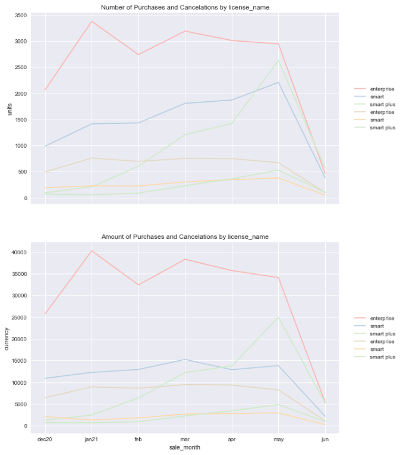
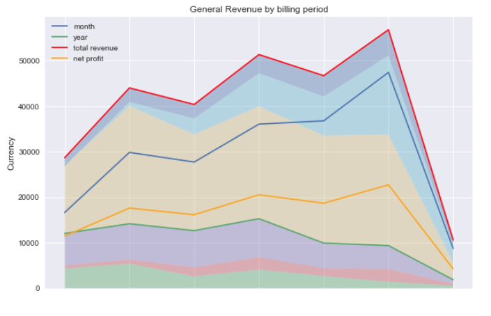
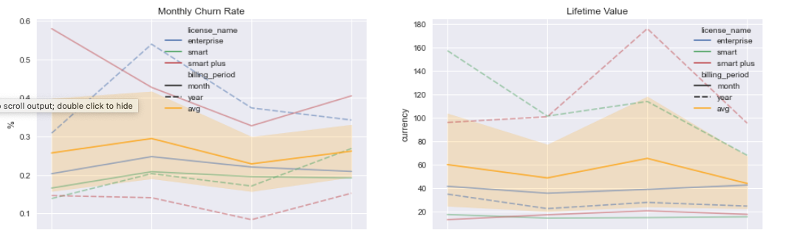
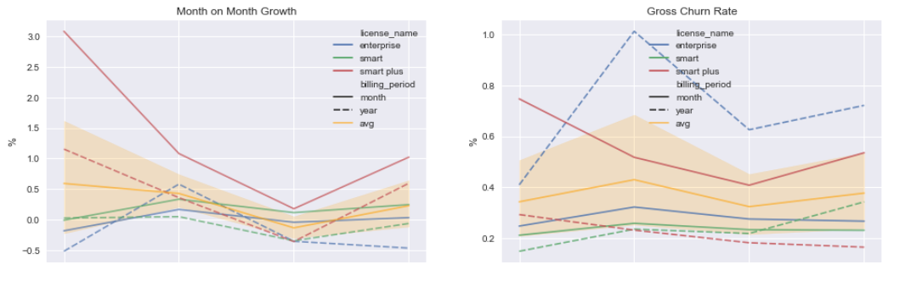
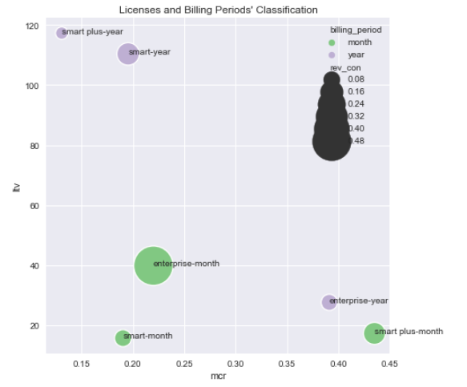

# BI Analysis: Web Subscriptions
Perform analysis for the subscription commerce project, which sells services for the online training platform.

## CONTENTS

* Objective
* Role
* Datasets
* Tools
* Code
* Results

## Objective
Carry out the operational analytics required to support decision making.  

Main tasks:
* Dynamics of the number of purchased subscriptions by month
* Dynamics of the number of active subscriptions by month
* Revenue dynamics
* Churn Rate
* LTV
* other metrics are encouraged

Bonus:
* define the packages a subscription price increase is possible for
* determine if there are data anomalies

SQL Tasks:
* Write a query that calculates cumulative growth of the number of subscription purchases each month, split by subscription type.
* Write a query that allows to get a cohort analysis to calculate % Retention Rate.

## Role
BI Analyst who interprets and analyzes the anonymized dataset.

## Dataset
The file 'subscription_dataset_DA_test_task.csv' in the [data folder](https://github.com/aldamepi/BI-web-subscriptions/tree/master/data) contains all the provided registers.
The same folder has this dataset cleaned and transformed for the required tasks.

## Tools
* Python 2.9
* Jupyter Notebook 6.4.5 (with extensions) 
* Tableau 2022.2.1
* MySQL Workbench 8.0

## Code
The Python code with the calculations is in the notebook: 'testTask_data-amengual-aug22.ipynb'.
The SQL code is in the [sql folder](https://github.com/aldamepi/BI-web-subscriptions/tree/master/sql).

## Results
The results of this analysis are displayed below and two more different sections:
1. __Jupyter-notebook__ in the root of the repo containing: 
    + The performed exploratory analysis with 14 sequential sections.
    + A discussion of the possible lines of analysis
    + The calculations for the kpis required and others such as Month over Month Growth, Gross Churn Rate, Average Order Value or Concentration Risk.
    + The insights and anomalies found during the analysis.
    + A discussion of the possibilities of increasing the prices by two ways: comparing to the majority of customers purchases and regarding the price elasticity.
2. __Exploratory Dashboard__: [view in Tableau Public](https://public.tableau.com/app/profile/alberto.mengual/viz/BIAnalysisWebSubscriptions/Dashboard1)

### Insights and Anomalies
* It seems there is a significant decrease in the Average Order Value in may for the _Smart_ license: Even though the number of purchases increases the amount remains the same.  

  

* It is interesting the increase of sales in the _Smart Plus_ license that brings an increase in incomes particularly in may.

Section 10.3.1:
* The number of _Trial_ cancelations decreases.
* The number of Smart Plus subscriptions purchased increases above the average (as well as its cancelations).

Section 10.3.2:
* The number of purchased subscriptions for _Enterprise_ does not grow. Moreover, in february drop.
* There are no yearly cancelations for smart plus. 

Section 11. Revenue Dynamics:  

  

* The revenue _Smart - Year_ subscriptions was higher than _Smart - Month_.
* During the months of april and may 2021 the revenue of the year subscriptions beging decreasing and the month subscriptions increase at the same time.
* The revenue for the _Smart Plus - Month_ subscriptios shows a considerable raise.

Section 12.7. Plot Churn Rate and Lifetime Value:  

  

* The __highest lifetime values__ correspond _Smart Plus - Year_ and _Smart - Year_ subscriptions.
* It is interesting the lowest lifetime values corresponds to _Enterprise_  that comprises the highest revenue.
* The _Smart Plus - Month_'s Churn Rate is unusually high.   
* The _Enterprise - Year_'s Churn Rate is unusually high in march and april.  
* The _Smart Plus - Year_'s  __churn rate is unusually low__.   

Section 13.3. Plot Month over Month Growth and Gross Churn Rate:  

. 

* Usually the year subscriptions grow slower than month subscriptions.
* The Gross Churn Rate of _Enterprise - Year_ is the highest.
* The _Smart Plus - Year_ subscriptions have __the highest Month on Month growth rate__.

### Prices increase

#### Majority of Purchases
Section 17.  

For every license_name (enterprise, smart plus and smart) and its billing periods (month and year) the average order value is approximately the same as the most expensive package for its category (license-period). Furthermore the majority (80%) of the customers purchase every month that amount or less of money.

1. One price strategy could be __creating new packages__: increasing not only the prices, but also adding more value by including new products and/or a discount in the packages.
    + I would suggest beginning with categories with __the lowest MCR, LTV and Revenue Concentration__:
        + _Smart-Month_: Despite its considerable amount of customers it reaches just 8% of revenue.
    + The other way round _Enterprise-Month_ concentrates almost 50% of the total Revenue as well as it has relatively low MCR and a considerable LTV. This category could be __the appropiate one to iniciate testing new packages with higher fees__.
    + In the other hand _Smart Plus-Year_ shows a low MCR and high LTV but represents the lowest concentration of the revenue. Here stand the lowest fees for the year subscriptions. And the mount of customers is rather negligible compared to other categories.
  
2. For licenses that had similar products in both month and year billing period, it would be interesting considering an increase of the year version aiming the value in avgKpis['yearAov']. In order to __get a proportion of year over month billing period similar to the ACL__.

Furthermore, I would study how to reduce the MCR in _Enterprise-Year_ and _Smart Plus-Month_ licenses.  

#### Linear Elasticity
Section 18.

